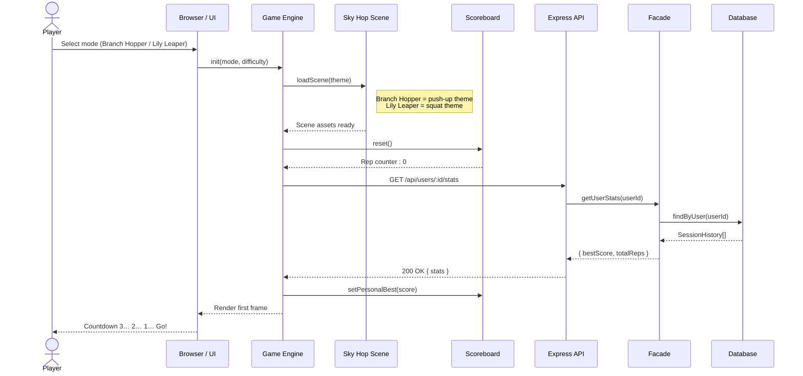
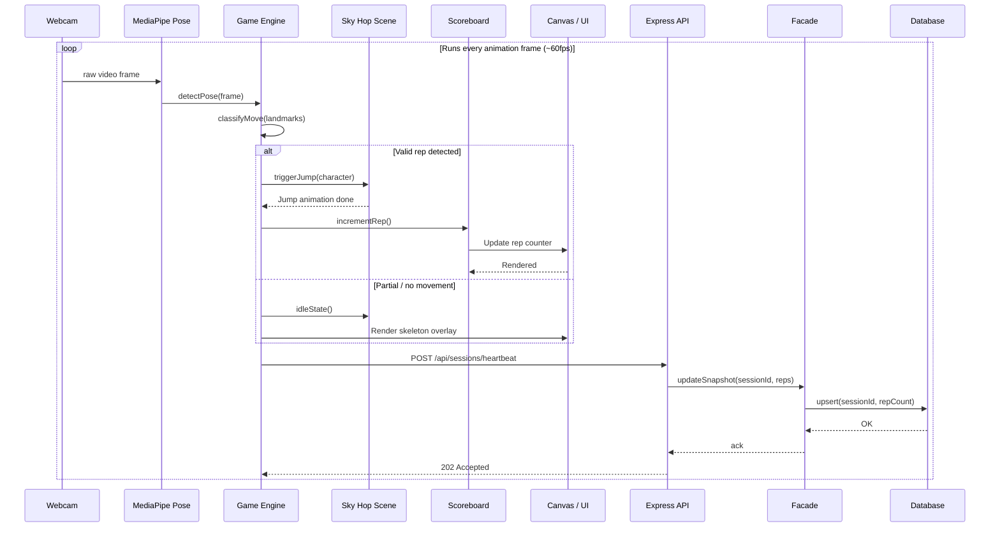
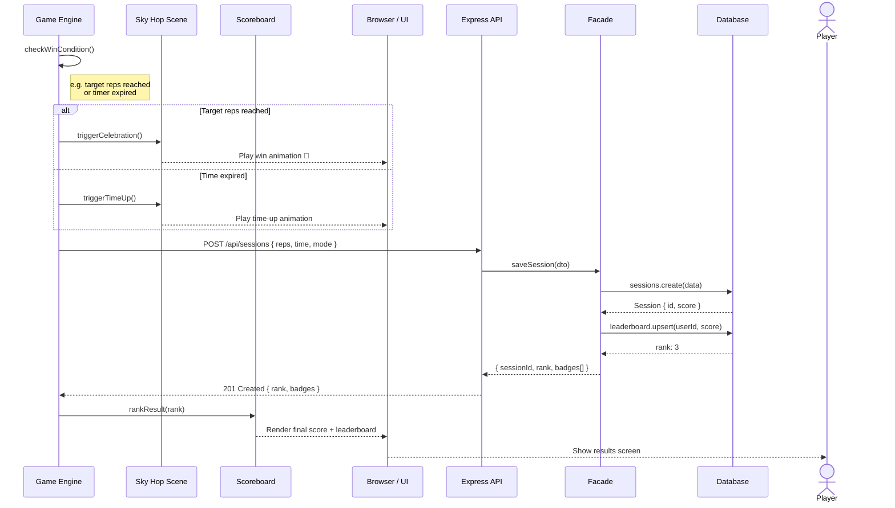
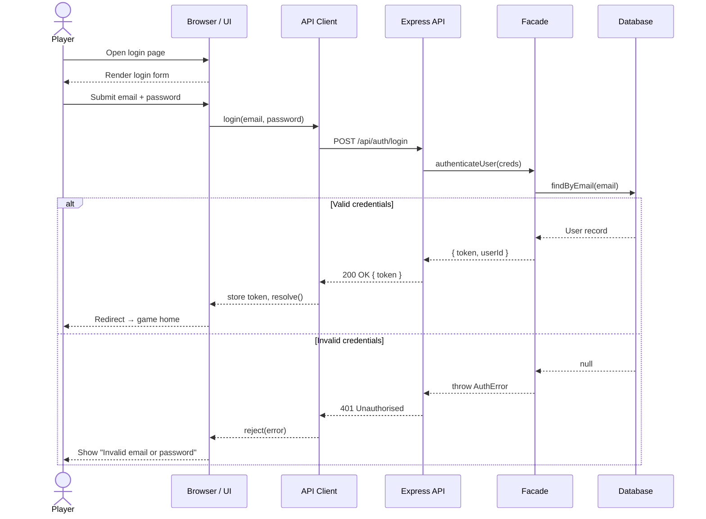

# High Level Architecture - High-level sequence diagram

1. App Initialisation
 ```mermaid
 sequenceDiagram
  actor Player
  participant Browser as Browser / UI
  participant Webcam as Webcam API
  participant MP as MediaPipe Pose
  participant API as Express API
  participant Facade
  participant DB as Database

  Player->>Browser: Open Sky Hop app
  Browser->>API: GET /api/auth/verify-token
  API->>Facade: verifyToken(jwt)
  Facade->>DB: findById(userId)
  DB-->>Facade: User record
  Facade-->>API: { valid: true, userId }
  API-->>Browser: 200 OK → skip login

  alt Permission granted
    Browser->>Webcam: navigator.mediaDevices.getUserMedia()
    Webcam-->>Browser: Video stream ready
    Browser->>MP: loadModel(pose_landmarker)
    MP-->>Browser: Model loaded
    Browser-->>Player: Show "Start Game" screen
  else Permission denied
    Webcam-->>Browser: Error: NotAllowedError
    Browser-->>Player: Show permission error + retry
  end
 ```

2. Start of the game


3. Game Loop


4. End of the game


5. Login / Authentication

