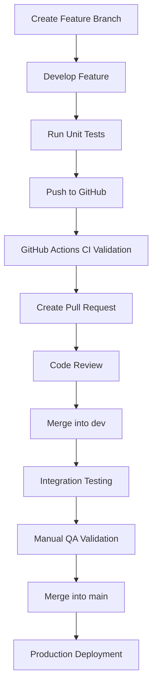

# 🧪 MoveVerse QA Strategy

## 📖 Purpose

This document defines the Quality Assurance (QA) strategy for the MoveVerse project.

The QA strategy ensures:

- Application stability
- Reliable authentication flows
- Accurate workout tracking
- Proper frontend-backend integration
- Consistent user experience
- Reduced production bugs

MoveVerse implements:

- Unit Testing
- Integration Testing
- API Testing
- Manual Testing
- CI Validation using GitHub Actions

---

# 👥 Testing Responsibilities

| Team Member | Responsibility |
|---|---|
| All Developers | Unit testing assigned modules |
| Full Stack Engineer | Integration testing |
| Entire Team | Manual QA validation before merging and release |

---

# 🧩 Unit Testing Strategy

## Purpose

Unit testing validates isolated functions, services, and components independently.

This helps detect issues early during development before integration occurs.

---

## Backend Unit Testing

### Tool

- Jest

### Areas to Test

| Component | Example Validation |
|---|---|
| Authentication Services | JWT generation and validation |
| Controllers | Request and response handling |
| Middleware | Token verification |
| Utility Functions | Score calculations |
| Database Services | Query logic validation |

---

## Frontend Unit Testing

### Tools

- Vitest
- React Testing Library

### Areas to Test

| Component | Example Validation |
|---|---|
| Buttons | Click interactions |
| Forms | Validation behavior |
| Router | Protected routes |
| Theme Context | Theme switching |
| Dashboard UI | Correct rendering |
| Error Components | Proper error display |

---

# 🔗 Integration Testing Strategy

## Purpose

Integration testing validates communication between system layers.

Examples:

- Frontend ↔ Backend
- Backend ↔ PostgreSQL
- Authentication ↔ Protected Routes
- Motion Detection ↔ Session Tracking

The Full Stack Engineer manages integration testing workflows.

---

## Integration Testing Areas

| Feature | Validation Goal |
|---|---|
| Login System | Authentication workflow |
| Workout Sessions | Score persistence |
| Leaderboard | Ranking updates |
| Achievements | Unlock persistence |
| JWT Authentication | Route protection |
| Database Integration | Data storage consistency |

---

## Integration Testing Tools

| Tool | Purpose |
|---|---|
| Postman | API validation |
| Jest + Supertest | Backend integration testing |
| Docker | Local environment consistency |

---

# 🌐 API Testing Strategy

MoveVerse uses Postman for API testing and endpoint validation.

## APIs Covered by Automated Testing

| API | Purpose |
|---|---|
| Authentication APIs | Validate secure authentication |
| Workout Session APIs | Validate core gameplay features |
| Leaderboard APIs | Validate ranking retrieval |
| Achievement APIs | Validate achievement tracking |
| Protected Routes | Validate authorization access |

---

## Example API Test Cases

```text
- Successful login
- Invalid password rejection
- JWT validation
- Workout session creation
- Leaderboard retrieval
- Unauthorized route prevention
```

---

# 🖐️ Manual Testing Strategy

Because MoveVerse is a browser-based motion detection application, several workflows require real user interaction and visual validation.

Manual testing validates:

- Camera access
- Motion detection responsiveness
- Gameplay experience
- Browser compatibility
- Responsive layouts
- User interaction flow

---

## Features Covered by Manual Testing

| Feature | Validation |
|---|---|
| Motion Detection | Real user movement validation |
| Exercise Gameplay | Visual interaction testing |
| Camera Permissions | Browser permission handling |
| Responsive Design | Multi-device validation |
| Navigation Flow | User experience testing |
| Dashboard UI | Layout consistency |
| Error Handling | Proper feedback visibility |

---

# 🎮 End-to-End (E2E) Testing Plan

MoveVerse implements browser-level workflow validation using Playwright.

## Tool

- Playwright

## Purpose

Playwright validates complete user workflows from frontend interaction through backend processing.

---

## E2E Testing Scenarios

```text
- User registration
- Login workflow
- Starting workout sessions
- Completing exercise sessions
- Score submission
- Leaderboard viewing
- Achievement unlock workflow
```

---

# ⚙️ Continuous Integration (CI) Strategy

MoveVerse uses GitHub Actions for automated CI validation.

GitHub Actions automatically validates code changes during:

- Pull requests
- Pushes to dev
- Pushes to main

---

## CI Workflow Purpose

The CI workflow ensures that unstable or broken code is detected before merging into shared branches.

Automated validation includes:

- Dependency installation
- Frontend build validation
- Backend validation
- Unit testing
- Linting

---

## Initial CI Workflow

### Frontend Validation

```text
- npm install
- npm run build
```

### Backend Validation

```text
- npm install
```

---

## Expanded CI Workflow

As the project grows, CI pipelines will additionally execute:

```text
- npm run lint
- npm test
- integration tests
- Docker validation
```

---

# 🔄 QA Workflow Diagram



---

# 🚀 Future CI/CD Expansion

The MoveVerse CI pipeline will later expand to support:

- Automated deployment workflows
- Docker container validation
- Staging environments
- Production deployment automation

---

# ✅ Conclusion

The MoveVerse QA strategy establishes a structured testing and validation workflow to ensure application reliability and maintainability.

By combining:

- Unit testing
- Integration testing
- API validation
- Manual testing
- E2E testing
- GitHub Actions CI validation

The MoveVerse team improves:

- Software stability
- Development consistency
- Team collaboration
- Production reliability
- Long-term scalability
